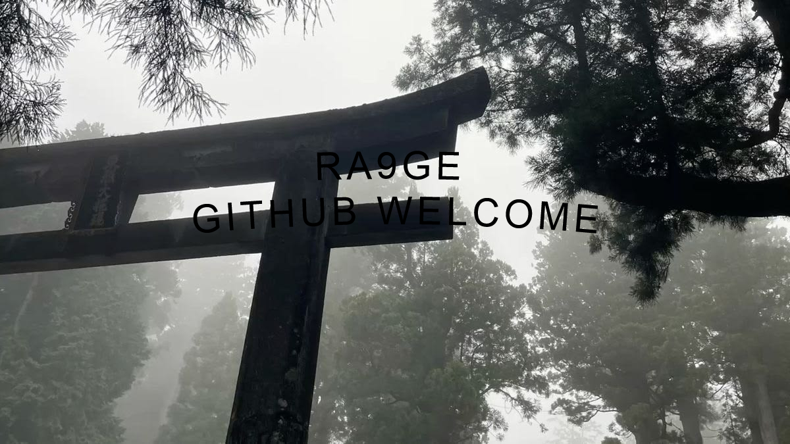

  
  
  

<h1 align="center">call38</h1>
<h3 align="center">Frontend & Backend Developer</h3>

  

 

<h2><code>&gt; ~/about</code></h2>

  <code>[✓] Working in software development, actively exploring new domains.</code> 
  <code>[✓] 2 years of experience in programming.</code>

 

<h2><code>&gt; ~/contact</code></h2>

  <code> Telegram:</code> <a href="https://t.me/et3ha">@et3ha</a> 
  <code> Email:</code> <a href="mailto:nootwix@gmail.com">nootwix@gmail.com</a> 
  <code> Site:</code> <a href="https://senku.one">senku.one</a>

 

<h2><code>&gt; ~/stack</code></h2>

    
  

 

<h2><code>&gt; ~/stats</code></h2>

  
  

 

<h2><code>&gt; ~/trophies</code></h2>

  

 

<h2><code>&gt; ~/activity</code></h2>

  

  

 

<h2><code>&gt; ~/contribution-snake</code></h2>

  <picture>
    <source media="(prefers-color-scheme: dark)" srcset="https://raw.githubusercontent.com/call38/call38/output/github-contribution-grid-snake-dark.svg" />
    <source media="(prefers-color-scheme: light)" srcset="https://raw.githubusercontent.com/call38/call38/output/github-contribution-grid-snake.svg" />
    
  </picture>

 

  

